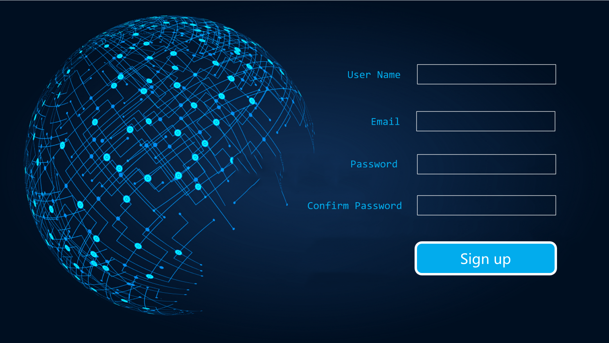
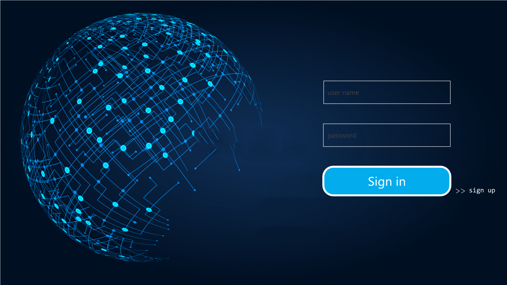
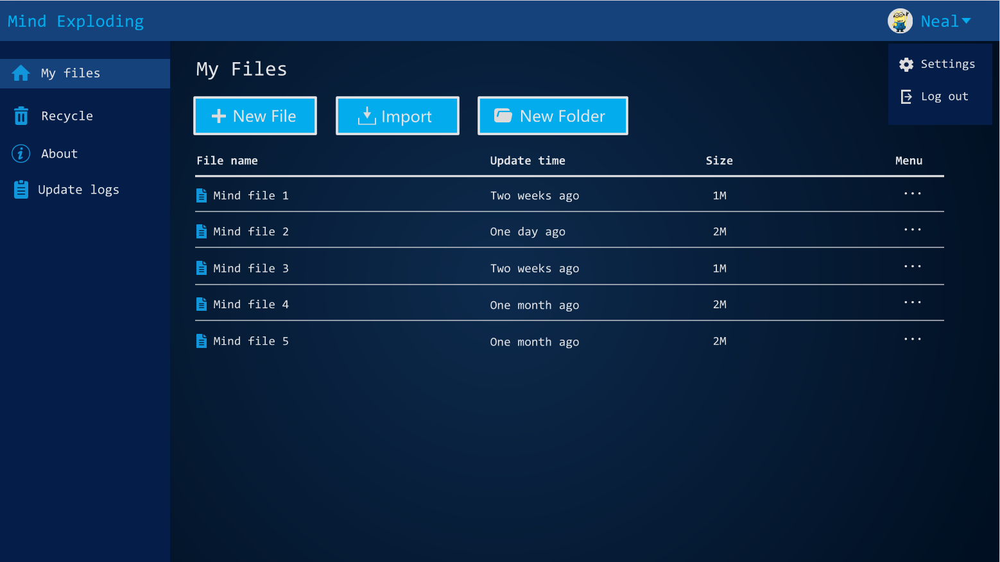
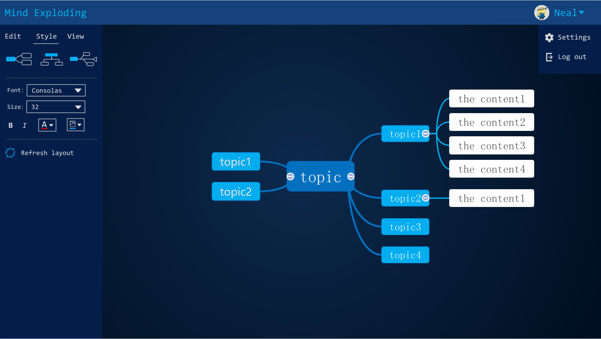
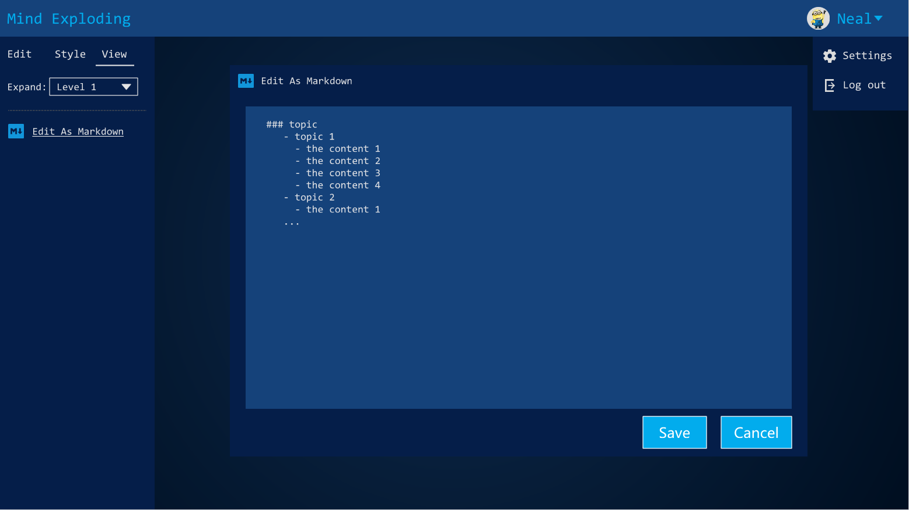
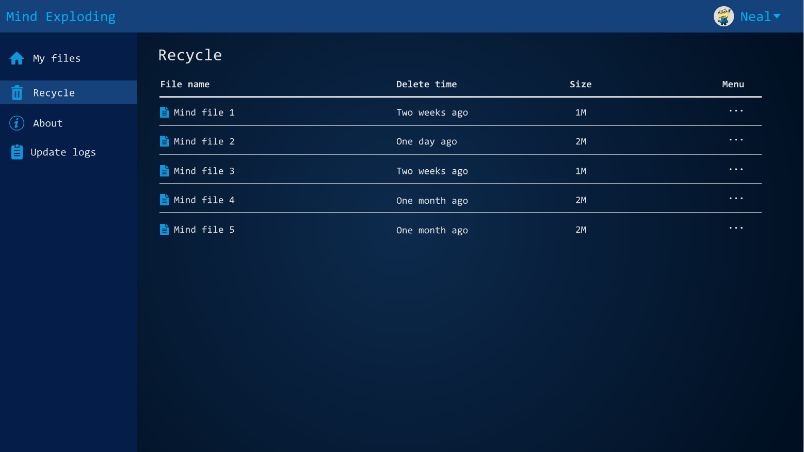
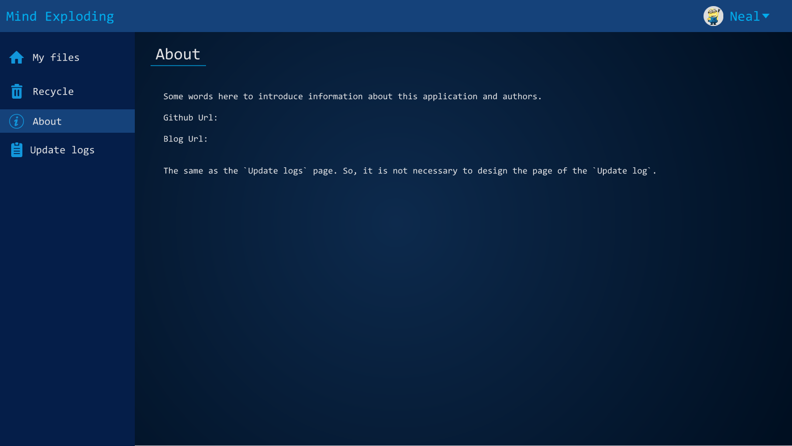
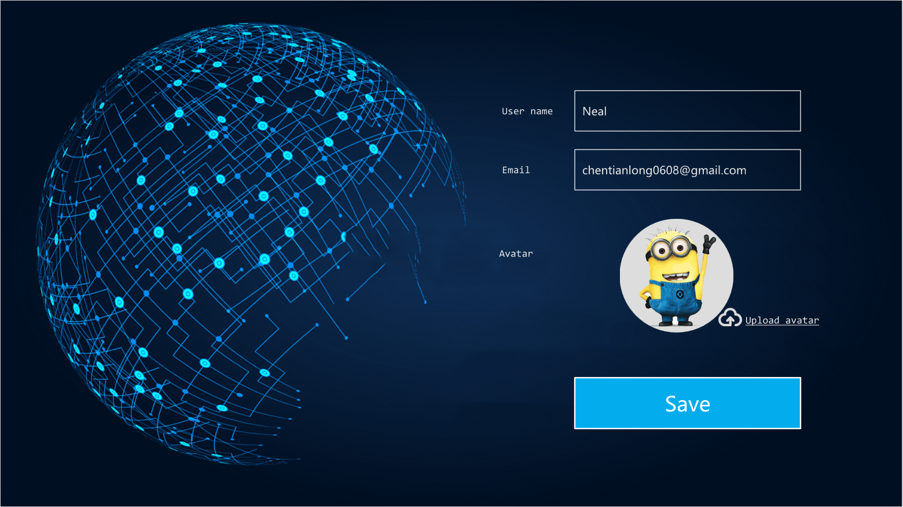

# Mind-Exploding
> It is a mind map web application. You can create or import a mind map file in this website. And all of your files will be stored by this website. All you need to do to get your file is to sign in this website, then it will post all of your files as a list, you can edit or view your mind map by click the file title. It is really easy for you to create an mind file and collect your mind.

This application is developing now, and here is the desine of this website.

### Home page

### Sign up

### Sign in

### My files

### File - Edit

### File - Style

### File - View

### Edit As Markdown

### Recycle

### About

### Setting page

All above is designed by [EasiNote5](https://easinote.seewo.com/). The design file is at the *design* folder.
